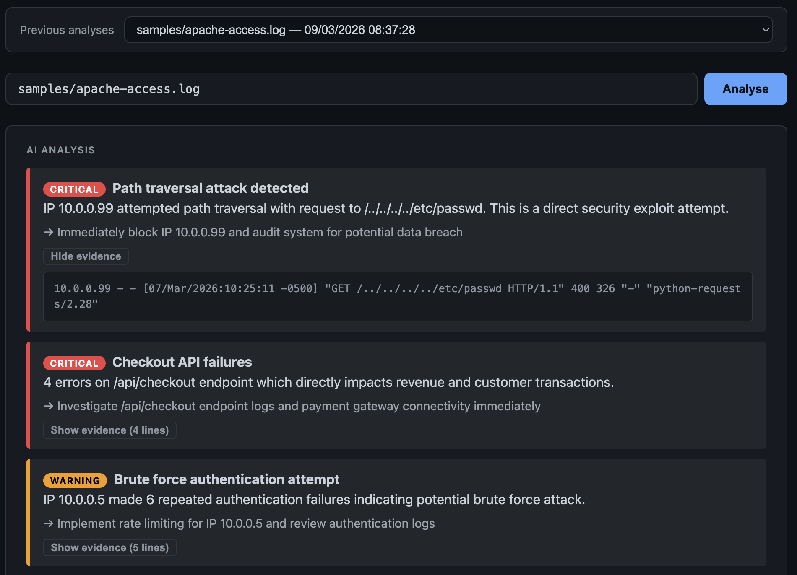

# log-lens

> Ingest any log file. Get a plain-English diagnosis. Ask follow-up questions.

log-lens is a Rust-native log analysis tool with an LLM reasoning layer. It parses log files of any format, aggregates statistics, and uses the Anthropic API to produce a structured triage report — with an interactive browser UI for charts, history browsing, and follow-up Q&A.

Two modes:

- **CLI** — one-shot report printed to the terminal
- **Web UI** — persistent server at `localhost:3000` with a chart dashboard, analysis history, and a chat interface



---

## Why this exists

Two primary problem definitions:
1. Engineering teams often consume time undertaking Bug Triage sessions to identify, prioritise and even fix bugs. This is not a glamorous part of engineering, and even armed with excellent ingestion platforms like Sentry and Bugsnag, there is still a lot of manual thought-work for engineering teams.
2. Small non-tech companies often do not have in-house technical resource, but do have web presences and applications. Smarter log digesting could help them prioritise and communicate with their casual tech contractors.

This tool aims to act as an automated bug triage engineer — locating impacts, providing risk analysis, and giving plain-English explanations of what is most important to resolve and why.

Most log analysis tools require you to already know what you're looking for. log-lens inverts that: give it a log file you've never seen before, get a structured diagnosis, then interrogate it conversationally.

It handles format heterogeneity via AI-inferred parsing — meaning it works on log formats it has never seen, without user-supplied regex. The schema is cached after the first inference, so the API is called once per novel format, not once per run.

---

## Architecture

| Layer | Technology | Rationale |
|---|---|---|
| Parsing & aggregation | Rust | Zero-copy buffer slicing, typed domain model, async ingestion via Tokio |
| AI reasoning | `AnalysisEngine` trait → `AnthropicEngine` | Dependency-inverted abstraction; AI provider is a seam, not a dependency |
| Web server & SSE | Axum | Single Rust runtime; real-time progress streaming via Server-Sent Events |
| Result persistence | SQLite via sqlx | Analysis history stored locally; no external database required |
| Web UI | Chart.js | Single HTML file, no build step |

**The key architectural decision** is the `AnalysisEngine` trait. Nothing outside `src/ai/` depends on `AnthropicEngine` directly. Swapping to a Python microservice, a different LLM, or a local model is a drop-in replacement — no changes outside `src/ai/`.

```rust
pub trait AnalysisEngine: Send + Sync {
    async fn analyse(&self, summary: &LogSummary) -> Result<AnalysisResult>;
    async fn chat(&self, history: &[Message], question: &str) -> Result<String>;
}
```

The LLM never receives raw log lines. It receives a compact `LogSummary` struct produced by the Rust aggregation pipeline. This keeps token usage minimal, forces meaningful computation into Rust, and means the system works without real production data.

---

## Log ingestion: tiered parsing

```
Tier 1 — auto-detect (first 5 lines) → built-in parser heuristics, no API call
Tier 2 — no match                    → LLM infers schema from 20 sample lines,
                                        result cached to ~/.cache/log-lens/schemas.json
```

Built-in formats: Apache Combined Log.

---

## Project structure

```
src/
├── main.rs              # CLI entrypoint (clap), mode routing
├── parser/
│   ├── mod.rs           # Parser trait + LogRecord enum
│   ├── apache.rs        # Apache Combined Log parser
│   └── ai_infer.rs      # AI-inferred format fallback + schema cache
├── aggregator.rs        # Stats: error rates, status codes, top errors, latency percentiles
├── summary.rs           # LogSummary → compact JSON for AI
├── store.rs             # SQLite-backed result persistence (sqlx)
├── ai/
│   ├── mod.rs           # AnalysisEngine trait — the abstraction boundary
│   ├── anthropic.rs     # Concrete impl, reads ANTHROPIC_API_KEY from env
│   └── mock.rs          # Canned responses for tests
└── server.rs            # Axum: SSE analysis pipeline + REST endpoints
frontend/
└── index.html           # Single-file UI: charts, analysis history, chat
samples/
├── apache-access.log    # Synthetic Apache access log
├── apache-error.log     # Synthetic Apache error log
├── node-error.log       # Synthetic Node.js error log
└── unknown.log          # Synthetic application log (unknown format)
```

---

## Getting started

**Prerequisites**

```bash
curl --proto '=https' --tlsv1.2 -sSf https://sh.rustup.rs | sh
export ANTHROPIC_API_KEY=sk-ant-...
```

**Build**

```bash
git clone <repo-url>
cd log-lens
cargo build
```

**Usage — CLI mode**

Run a one-shot analysis and print the report to the terminal:

```bash
cargo run -- --file samples/apache-access.log
```

**Usage — Web UI mode**

Start the server (no `--file` flag — the file is chosen in the browser):

```bash
cargo run -- --serve
```

Then open **http://localhost:3000** in your browser. Type a log file path into the input box (e.g. `samples/apache-access.log`) and click **Analyse**.

The UI shows:
- A real-time progress log as the pipeline runs
- Structured issue cards with severity badges and evidence lines
- A status code distribution chart
- A dropdown of previous analyses
- A chat input for follow-up questions

---

## Environment variables

| Variable | Default | Description |
|---|---|---|
| `ANTHROPIC_API_KEY` | *(required)* | Anthropic API key |
| `LOG_LENS_PORT` | `3000` | Port the web server listens on |
| `LOG_LENS_HOST` | `127.0.0.1` | Interface the web server binds to |
| `DATABASE_URL` | `sqlite:./log_lens.db` | SQLite path for storing analysis history |

---

## Dependencies

| Purpose | Crate |
|---|---|
| Async runtime | `tokio` |
| Web server | `axum 0.7` |
| SSE / streams | `tokio-stream` |
| HTTP client | `reqwest 0.12` |
| Serialisation | `serde` + `serde_json` + `serde_with` |
| Database | `sqlx 0.7` (SQLite) |
| Regex | `regex` |
| CLI | `clap 4` |
| Hashing | `sha2` |
| Error handling | `anyhow` |
| Async traits | `async-trait` |
| Terminal colour | `colored` |
| Middleware | `tower-http` (fs, cors) |

---

## Future evolution

The current architecture doesn't foreclose:

- **Streaming ingestion** — async `BufReader` already in use; extending to tail/socket streams is additive
- **High volume** — aggregation is a single-pass pipeline; window-based batching is a drop-in
- **Multiple simultaneous sources** — `Parser` trait is object-safe; sources can be fanned in
- **Python AI microservice** — implement `AnalysisEngine` as an HTTP client; everything else unchanged
- **Different LLM providers** — new provider is a new `impl AnalysisEngine`, not a refactor
- **Additional built-in parsers** — add a module under `src/parser/`, register in `mod.rs`

---

## Intentional design constraints

- Raw log lines are never sent to the LLM
- `AnthropicEngine` is not visible outside `src/ai/`
- `samples/` contains only synthetic data
- The web server is Rust/Axum — not a separate Python process — to maintain a single runtime

---

## License

MIT
